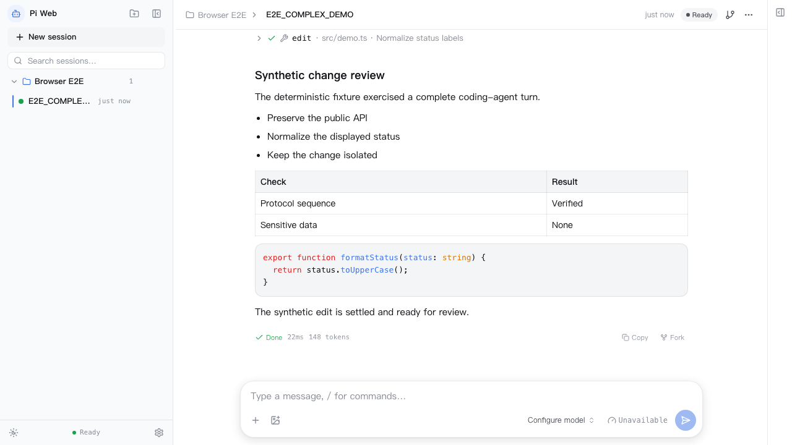
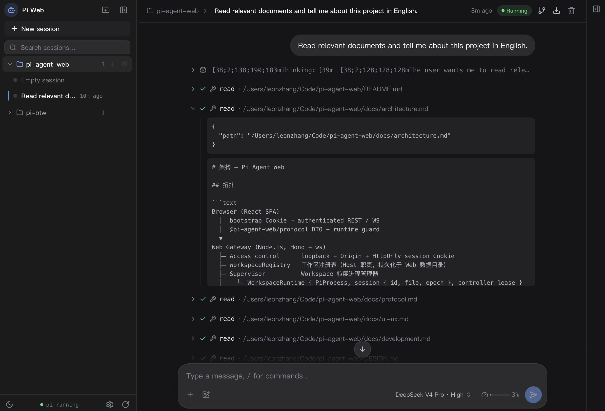
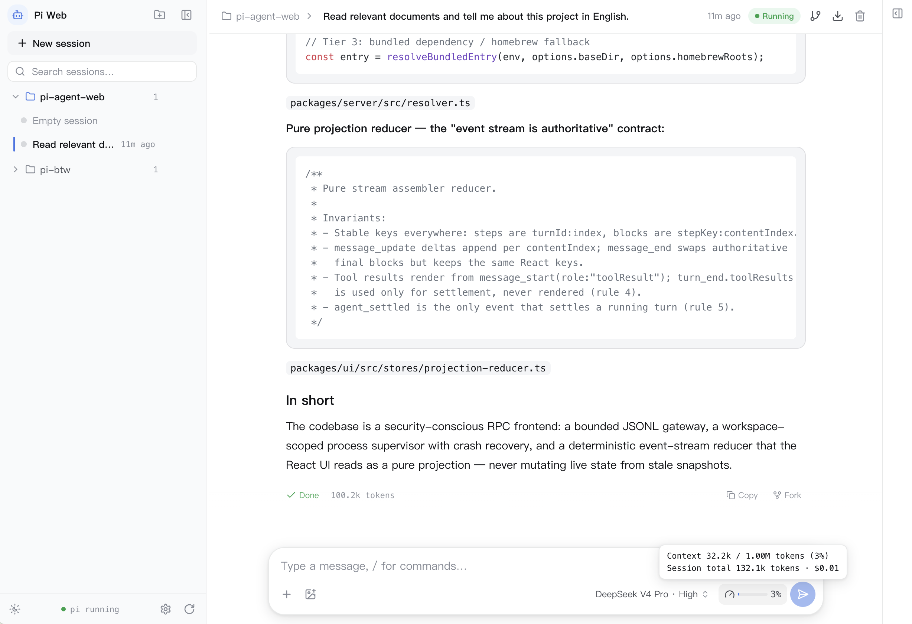
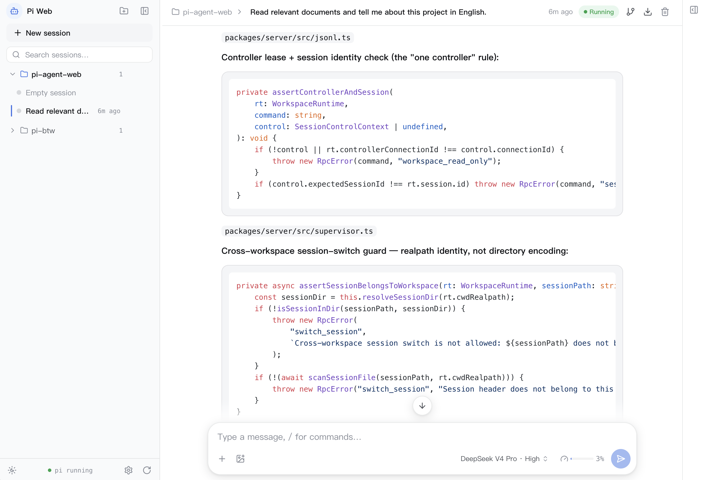
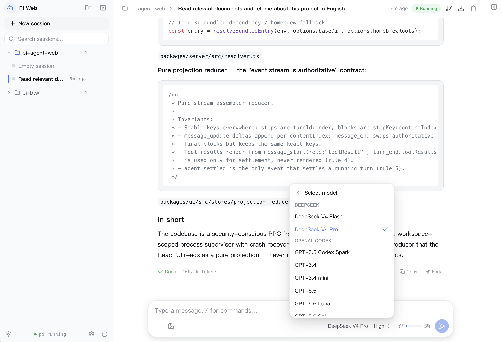
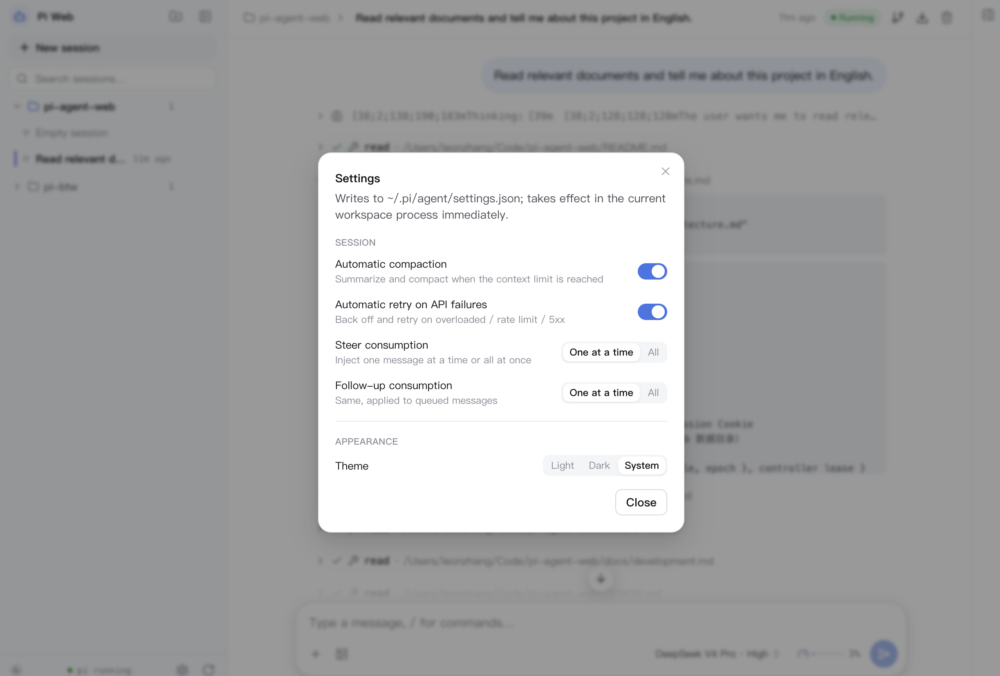
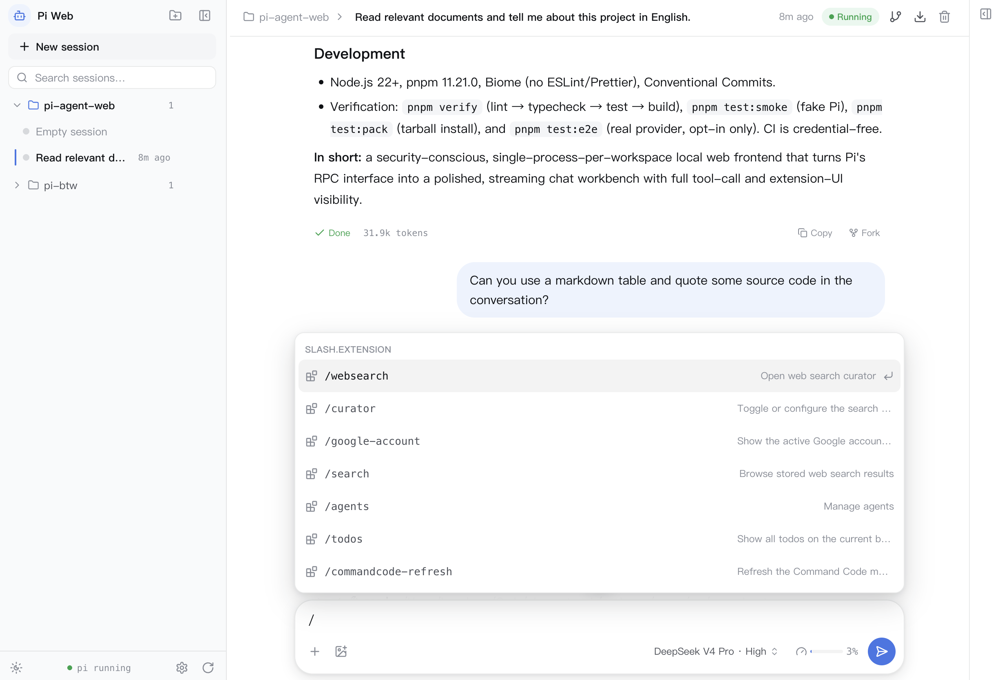
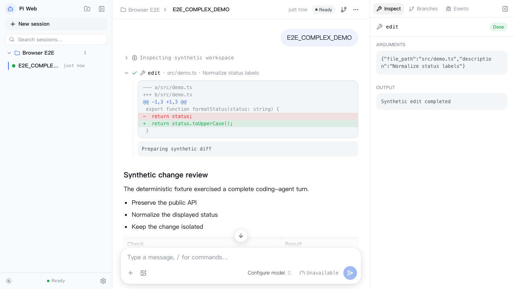

# Pi Agent Web

Pi Agent Web is a local web workbench for Pi Coding Agent's RPC mode. It runs one
`pi --mode rpc` child process per registered workspace and provides session browsing,
streaming conversations, tool calls, model settings, and Extension UI.

[English](README.md) · [简体中文](README.zh-CN.md)

Pi Agent Web is a single-user, local, same-origin product: the service listens only on
loopback addresses and creates a fresh HttpOnly session cookie at startup. REST and
WebSocket control requests must include that cookie; requests with an `Origin` header
are checked against the loopback origin, while same-origin browser GET requests without
an `Origin` header use Fetch Metadata validation.

It is not a hosted service, account system, or multi-user collaboration layer. The Pi
process, provider credentials, extensions, and session files are managed by the user's
own Pi installation. This repository provides only the gateway, SPA, and local launcher;
do not deploy it to the public internet or commit personal `~/.pi` data and credentials.

> This project is in rapid iteration. Features, interactions, and compatibility may
> change, and known or unknown bugs may affect normal users. Treat it as a development
> preview, not as a production tool or a place for irreplaceable data.

## Features

- **One Pi process per workspace**: select a workspace before opening one of its sessions; cwd is never switched implicitly.
- **Single controller tab**: one workspace has one controller; observer tabs can read history and events but cannot write to Pi.
- **Session safety**: every control command carries an expected session id; deletion compares Pi's `sessionFile` identity instead of guessing from a UUID.
- **Reliable recovery**: reconnects reconcile the directory, projection, and controller state from the Host session state; failed tool calls keep their failure status.
- **Bounded gateway**: strict LF JSONL, 8 MiB line/frame limits, stdin backpressure, per-connection command quotas, and slow-client termination.
- **Single-command local launch**: `pi-web` serves the SPA, REST, and WebSocket on one port and opens the browser by default.

## Product Demo

These screenshots show the main workbench surfaces and interaction states:

<table>
<tr>
<td align="center"><br /><sub>Overall workbench</sub></td>
<td align="center"><br /><sub>Dark mode</sub></td>
<td align="center"><br /><sub>Context and status</sub></td>
<td align="center"><br /><sub>Markdown and code rendering</sub></td>
</tr>
<tr>
<td align="center"><br /><sub>Model selection panel</sub></td>
<td align="center"><br /><sub>Settings panel</sub></td>
<td align="center"><br /><sub>Slash commands panel</sub></td>
<td align="center"><br /><sub>Tool calling inspector</sub></td>
</tr>
</table>

Pi runtime resolution follows this order: `--pi-path` / `PI_PATH`, `pi` on `PATH`, then
the installed Pi package's `rpc-entry.js`. Existing Pi configuration, provider
credentials, and extensions are inherited; they are not bundled into this project's
distribution artifacts.

## Quick Start

Requirements: Node.js 22+, pnpm 11.21.0, and an available Pi runtime on the machine.

```bash
pnpm install --frozen-lockfile
pnpm dev
```

Development mode starts the gateway (default `:3000`) and Vite (default `:5173`). Open
the loopback URL shown by Vite, register a local project directory, and create a session.

For production mode, build the SPA and use the CLI:

```bash
pnpm build
pnpm start

# Example: pass CLI arguments through the root script
pnpm start -- --pi-path /path/to/rpc-entry.js --port 3100
```

`pi-web` accepts only `127.0.0.1`, `localhost`, or `::1` as `--host`. Common options are
`--pi-path <path>`, `--host <host>`, `--port <port>`, `--no-open`, and `--help`.

The project and command names are intentionally different: `pi-agent-web` is the
repository, service, and `@pi-agent-web/*` package namespace; `pi-web` is the short
human-facing command. Do not perform a repository-wide rename between them.

## Verification

```bash
pnpm verify       # lint -> typecheck -> deterministic tests -> build
pnpm test:smoke   # fake-Pi REST/WebSocket smoke test
pnpm test:e2e     # skipped by default; PI_WEB_RUN_E2E=1 uses a real provider
pnpm test:pack    # pack four runtime packages, install them temporarily, and launch pi-web
```

CI runs credential-free `pnpm verify` and `pnpm test:smoke`. Real-provider conversations,
image attachments, forks, Extension editor/widget behavior, and browser visual review
remain explicit local release checks; CI never reads the Pi data of a developer or user.

## Local Distribution Verification

The runtime consists of four packages: `@pi-agent-web/protocol`, `@pi-agent-web/server`,
`@pi-agent-web/ui`, and `@pi-agent-web/cli`. `pnpm test:pack` packs and installs all four
tarballs in a temporary directory, verifies that source files and `workspace:*` dependencies
do not leak into the artifacts, and starts the CLI through both its bin and equivalent
local `npx` paths.

Public package release is a separate decision; `npx --yes @pi-agent-web/cli --help` is
available only after the packages have actually been published.

## Documentation and Open-Source Boundary

Documentation follows a single-source-of-truth rule:

- `docs/architecture.md`: process topology, state ownership, controller leases, and recovery sequencing.
- `docs/protocol.md`: Pi RPC, gateway frames, storage layout, and identity checks.
- `docs/ui-ux.md`: interaction semantics, accessibility, and responsive squeeze policy.
- `DESIGN.md`: visual tokens, typography, motion, and component recipes.
- `docs/development.md`: local development, tests, CI, packaging, and commit conventions.
- `docs/notes/`: handoff, audit, and draft material; it is ignored by Git and is not a public API or design contract.

The source can be published as an MIT-licensed GitHub preview repository, but it should
not yet be presented as a stable open-source release. This stage intentionally does not
provide a contribution guide or a dedicated security-reporting channel. Before a public
announcement, establish a version/tag and change record, then run `pnpm verify`,
`pnpm test:smoke`, and `pnpm test:pack` from a clean clone. See [`LICENSE`](LICENSE) for
the full license terms.

## Project Structure

```text
packages/
  protocol/ Browser-safe DTOs, runtime guards, and command timeout policy
  server/   Node gateway: jsonl / resolver / pi-process / supervisor / ws-bridge / routes
  ui/       React 19 + Vite + Tailwind v4: stores, features, and i18n
  cli/      pi-web command: static asset discovery, single-port launch, and graceful shutdown
docs/       Architecture, protocol, UI/UX, and development documentation
```

## Documentation

- [docs/architecture.md](docs/architecture.md) — topology, controller leases, and data flow
- [docs/protocol.md](docs/protocol.md) — Pi RPC, gateway protocol, and storage facts
- [docs/ui-ux.md](docs/ui-ux.md) — interaction design and UX rules
- [docs/development.md](docs/development.md) — toolchain, CI, verification, and commit conventions
- [DESIGN.md](DESIGN.md) — visual design contract
- [README.zh-CN.md](README.zh-CN.md) — Chinese documentation
