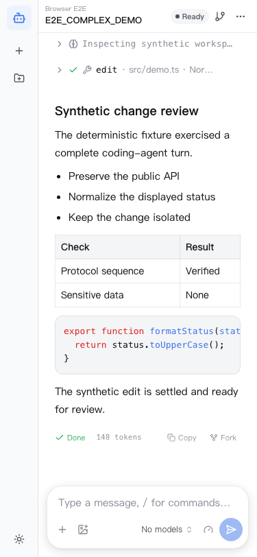

# Pi Agent Web

[English](README.md) · [简体中文](README.zh-CN.md)

Pi Agent Web 是 Pi Coding Agent RPC 模式的本机 Web 工作台，直接使用 Pi 原生 Session。它会打开
Pi 现有的 JSONL Session，让活跃 Session 独立运行；用户切换对话时，后台任务仍会继续。

Pi JSONL 始终是持久化事实来源。Pi Agent Web 不会把 Workspace 或 Session 历史复制到第二套
数据库。Workspace 来自各 JSONL Header 中规范化 `cwd` 路径的投影；轻量偏好存储只保留展示和
发现提示。

> Pi Agent Web 目前是开发预览版。界面与兼容性可能变化，缺陷也可能中断正常使用。重要工作请
> 纳入版本控制，并保留日常备份。

## 本地预览边界

网关是单用户、本机同源控制面，只监听 loopback 地址。bootstrap 请求签发 HttpOnly Cookie 后，
其余 REST 与 WebSocket 请求必须携带该 Cookie，并校验 loopback Host 以及 Origin 或 Fetch Metadata。这些措施面向本机浏览器
使用，不能替代托管服务、局域网部署、远程账户、多用户协作或敌对本机用户隔离。不要通过公网反向
代理暴露 `pi-web`。

Provider 凭据、扩展、设置和 JSONL 历史仍留在用户自己的 Pi 安装中。本仓库不会打包这些内容，无
凭据 CI 也不需要读取它们。

## 特性

- Pi 原生发现以 JSONL 文件的规范路径标识 Session，以 Header `cwd` 归组 Workspace。偏好
  设置不会替代、改写或删除原生历史。
- 每个热 Session 最多运行一个 `pi --mode rpc` 进程，休眠 Session 不占用进程；有界进程池允许
  同一 Workspace 或不同 Workspace 的 Session 并发运行。
- 浏览器与网关通过一条已认证 WebSocket 复用相互隔离的 Session 通道。控制租约、运行代次、
  `fencingToken`、序列游标、回放、重同步和 Extension UI 状态都按 Session 划分。
- 选择对话只会切换当前视图，其他已订阅 Session 继续接收事件；切换 Workspace 或 Session 不会停止
  后台任务。
- 工作台支持流式回复、思考与工具步骤、完整 GFM 与代码渲染、模型与思考强度控制、Slash 命令、
  Extension UI 以及图片附件，包括纯图片提示。
- 网关对 JSONL、帧、命令、回放和客户端缓冲设有边界。删除 Session 时会校验身份和
  `fencingToken`，再将文件移入可恢复回收区，而不是直接调用 `unlink`。

## 产品 Demo

工作台界面：

<table>
<tr>
<td align="center"><br /><sub>聚焦对话的工作台</sub></td>
<td align="center"><br /><sub>工具结果与上下文检查面板</sub></td>
</tr>
<tr>
<td align="center"><br /><sub>深色主题</sub></td>
<td align="center"><br /><sub>375 像素响应式界面</sub></td>
</tr>
</table>

所有 Demo 内容都来自确定性浏览器 fixture；截图不包含 Provider 凭据、私人路径或用户 Session 历史。

## Session 模型

```text
浏览器：当前视图 + 按 Session 划分的状态存储
  └─ 一条已认证 WebSocket，N 条相互隔离的 Session 通道
       └─ 网关：原生目录 + 有界热运行时池
            ├─ Workspace X / Session A ─ Pi 进程 A ─ A.jsonl
            ├─ Workspace X / Session B ─ Pi 进程 B ─ B.jsonl
            └─ Workspace Y / Session C ─ 休眠，仅保留 JSONL
```

当前 Session 是浏览器的视图指针，不是 Pi 的全局当前 Session。打开历史 Session 时，网关按需启动
对应进程；当进程池需要容量时，空闲且已持久化的 Session 可以回到休眠状态，之后仍从同一份
原生 JSONL 文件重新打开。

绝对路径的 Pi 默认、全局与环境配置目录不依赖 Web 偏好即可发现。仅由项目配置指定的
`sessionDir`，以及任何按 Pi child 的 Workspace cwd 解释的相对 Agent/Session 目录，都无法在
不知道 Workspace 路径时推导。移除 Workspace 只会移除这条发现提示，不会删除 JSONL；重新添加
同一规范路径即可恢复发现。

修改类命令必须携带准确的 Session 运行代次和当前 `fencingToken`。只读观察者无需取得控制权也能
跟随事件。重连时，有界回放会补齐已知缺口；如果游标或身份不确定，客户端会明确执行快照重同步。

## 快速开始

要求 Node.js 22+、pnpm 11.21.0，并准备一个 Pi Coding Agent 运行时。

```bash
pnpm install --frozen-lockfile
pnpm dev
```

开发模式默认启动 `:3000` 上的网关和 `:5173` 上的 Vite。打开 Vite 输出的 loopback 地址，添加
本地 Workspace，然后打开已有原生 Session 或新建 Session。

启动单端口 CLI 前，先构建 SPA：

```bash
pnpm build
pnpm start

# 通过根脚本传递 CLI 参数
pnpm start -- --pi-path /path/to/rpc-entry.js --port 3100 --no-open
```

`pi-web` 的 `--host` 只接受 `127.0.0.1`、`localhost` 或 `::1`。它依次从 `--pi-path` / `PI_PATH`、
`PATH` 中的 `pi`，以及已安装 Pi 包的专用 `rpc-entry.js` 解析运行时。常用参数有 `--pi-path`、
`--host`、`--port`、`--no-open` 和 `--help`。

命名边界有意保留：`pi-agent-web` 是仓库、服务和 `@pi-agent-web/*` 软件包命名空间；`pi-web` 是
面向用户的命令。

## 验证

```bash
pnpm verify                                      # lint、类型、确定性测试、构建
pnpm test:smoke                                  # fake Pi 驱动的已认证 REST/WebSocket
pnpm test:e2e                                    # fake Pi 驱动的打包产物浏览器 E2E
pnpm test:pack                                   # 打包安装四包、验证 help，并由 bin 启动工作台
PI_WEB_RUN_E2E=1 pnpm test:e2e:real              # 显式运行真实 Pi/Provider 兼容性测试
```

`pnpm test:e2e` 是 `pnpm test:browser` 的别名。CI 不使用 Provider 凭据，会运行 `verify`、
`test:smoke`、`test:pack` 和打包产物 Chromium 测试套件。真实 Pi 检查会使用开发者已经配置的 Provider，
因此必须显式运行。

真实 Pi 测试套件覆盖同一 WebSocket 上的多 Session 并发、纯图片输入、内容隔离、流式阶段的
follow-up 与 abort、clone rekey、父子历史隔离和 RPC 元数据。它使用隔离的临时 Workspace 与
Session、Web 数据及 Pi Agent 根目录，仅将 `auth.json` 与 `models.json` 复制进权限受限的临时
Agent 目录；不会加载用户扩展或设置，不会扫描或修改已有 Pi 历史，并会在每次运行结束后验证真实
`settings.json` 的指纹未发生变化。

## 分发状态

四个 `@pi-agent-web/*` 软件包尚未发布到 npm。请 clone 本仓库并使用上面的命令；目前不要依赖
`npx @pi-agent-web/cli` 安装。

`pnpm test:pack` 会在临时目录中为 protocol、server、UI 和 CLI 生成本地 tarball，检查软件包内容
与依赖并安装；随后通过可执行文件与等价的本地 `npx` 路径验证 `--help`，再由已安装的可执行文件
启动单端口工作台。这个流程只验证打包结果，不代表已经发布到 registry。

源码采用 [MIT License](LICENSE)。当前定位是 GitHub 预览版，不是稳定的 npm 或生产发行版。

## 项目结构

```text
packages/
  protocol/  Browser-safe DTO、运行时 guard 与命令策略
  server/    原生目录、有界 Session 运行时池、REST 与多路复用 WebSocket
  ui/        React 19 工作台、按 Session 划分的 store 与流式投影
  cli/       pi-web 启动器、静态 UI 发现与有界关停
docs/
  decisions/ 已接受的架构决策记录
  *.md       架构、协议、UI/UX 与开发契约
```

## 文档

- [架构](docs/architecture.md)：身份、进程所有权、并发与恢复
- [协议](docs/protocol.md)：已验证的 Pi RPC 事实与浏览器/网关契约
- [UI 与 UX](docs/ui-ux.md)：交互、可访问性与响应式行为
- [开发](docs/development.md)：测试层级、CI、打包与发布门禁
- [路线图](docs/roadmap.md)：本轮恢复完成项与有边界的后续 Issue
- [架构决策](docs/decisions/README.md)：已接受的决策与被拒绝的替代方案
- [视觉设计](DESIGN.md)：视觉变量与组件规则
- [English](README.md)：英文 README

`docs/notes/` 与 `tmp/` 下的文件是被 Git 忽略的过程材料，不是当前产品契约。
